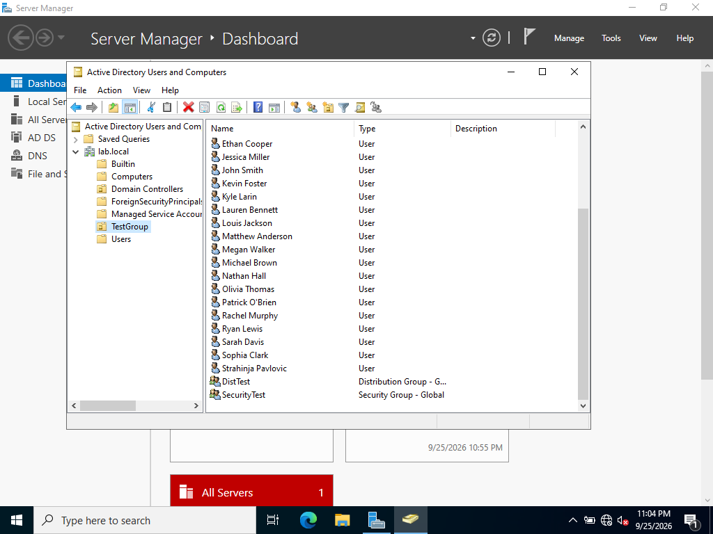

# Domain Design

## Lab Environment

This lab runs a single domain (`lab.local`) on a Windows Server 2022 domain
controller. All custom objects (test users and groups) are organized under
a single `TestGroup` OU rather than left at the domain root, to keep the
directory structure deliberate and reviewable.

## Design Exercise: Structuring a Post-Acquisition Company

Beyond the lab itself, I worked through a common real-world AD design
question: how would you structure a domain/forest for a company that just
acquired a smaller company, where the acquired company needs its own admins
and its own policies, but some shared trust is wanted eventually?

**Options considered:**

- **One domain, two OUs**: rejected. OUs allow delegated administrative
  control, but domain-wide settings (password policy, the overall security
  baseline) still apply across the whole domain. This doesn't give the
  acquired company's admins genuine independent authority. Domain Admins
  from the original domain retains ultimate control regardless of how OU
  permissions are delegated.
- **Two domains, same tree**: the right fit. Separate domains mean fully
  independent Domain Admins and independent domain-wide policies for each
  side, while domains in the same tree get automatic two-way transitive
  trust with no extra setup. This satisfies both the independence requirement
  and the "some shared trust eventually" requirement, out of the box.
- **Two separate forests**: considered and rejected for this scenario.
  Forests give genuine independence too, but with *no* trust by default.
  One would have to explicitly configure a forest trust afterward, which is
  more setup effort than the scenario actually called for.

This exercise also clarified a related point: AD's administrative privilege
tiers jump from **domain** (Domain Admins) straight to **forest** (Enterprise
Admins / Schema Admins). There is no intermediate "tree admin" role. Trees are
a purely structural/namespace concept (shared DNS namespace, automatic trust),
not an administrative one.