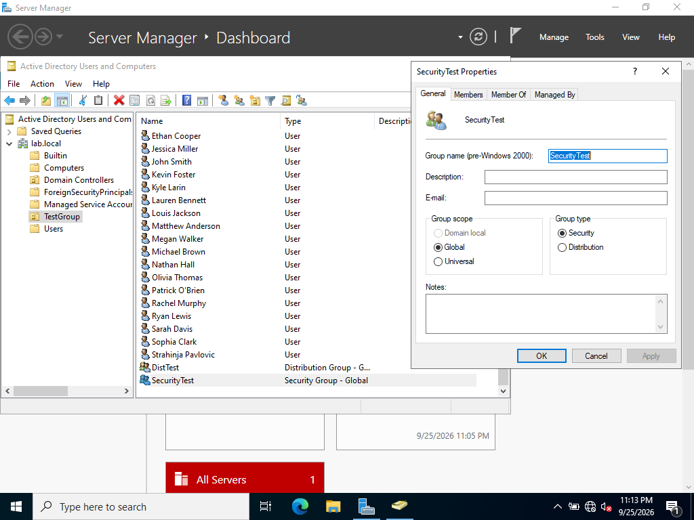

# Users and Groups

## Group Types: Security vs. Distribution

AD groups come in two types, chosen at creation and visible in the group's
Properties dialog above:

- **Security groups**: can be assigned actual permissions (file shares,
  delegated admin rights, anything access-control related). This works
  because Security groups are issued a **SID** (Security Identifier) which is the
  token Windows checks against when evaluating any permission.
- **Distribution groups**: email distribution lists only (used with
  Exchange/Outlook). They are never issued a SID, which is the literal,
  mechanical reason they cannot be granted permissions. There is no
  security token for an access control list to reference, not just a
  policy restriction.

I built one of each (`SecurityTest`, `DistTest`) to confirm the difference
directly rather than just take it as documented fact: the Distribution
group genuinely cannot be added to a resource's permissions list, while the
Security group can.

## An edge case worth knowing: SID persistence through type conversion

One detail that isn't obvious from the documentation alone: if an existing
**Security** group (already holding real permissions) is later converted to
**Distribution**, its SID is retained rather than removed. In practice, this
means permissions assigned while it was a Security group can keep functioning
even after the type is changed because the ACL still points at a SID that
still exists, even though the group's type label no longer reflects a
security principal. Microsoft doesn't officially support relying on this
behaviour, but it's a real, documented quirk worth knowing if you ever
encounter a Distribution group that unexpectedly still has resource access,
it likely means this is exactly what happened to it.

## Group Scope

Also visible above: **Domain Local**, **Global**, and **Universal** scope,
which control *where* a group can be used and *who* can be a member of it, this is
independent of the Security/Distribution type decision. A common real-world
pattern (**AGDLP**) nests them together: user **A**ccounts go into **G**lobal
groups, Global groups get nested inside **D**omain **L**ocal groups, and
**P**ermissions are assigned to the Domain Local group, separating "who's on
the team" from "what the team can access" into two different layers.