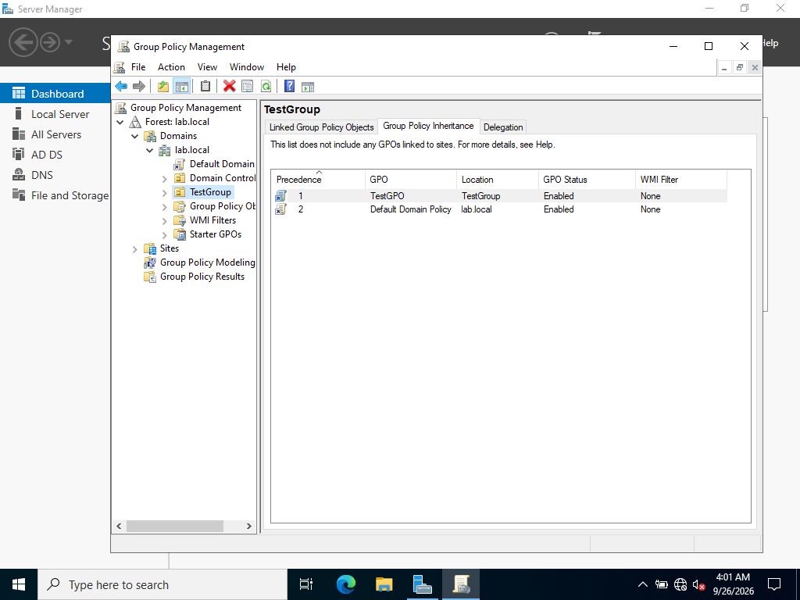

# Group Policy

## Inheritance

GPOs can be linked at the domain, OU, or site level, and settings linked
higher up **flow down** to everything beneath, a domain-level GPO applies
to every OU in that domain unless something further down explicitly
overrides it. The screenshot above shows this directly: `TestGroup`'s
**Group Policy Inheritance** tab lists both `TestGPO` (linked directly to
this OU, precedence 1) and `Default Domain Policy` (inherited from the
domain root, precedence 2). This proves the domain-level policy is actually
reaching this OU, not just linked somewhere in theory.

## Testing Block Inheritance

I tested what happens when that flow is deliberately interrupted: toggling
**Block Inheritance** on `TestGroup` removes `Default Domain Policy` from
this same inheritance list entirely which means it no longer reaches the OU at all.
This confirmed the mechanism directly rather than just reading about it:
Block Inheritance isn't a permission restriction, it's a structural cutoff
of the GPO flow itself.

## Enforced vs. Block Inheritance

A GPO can be marked **Enforced**, which overrides Block Inheritance
entirely. An Enforced GPO reaches a blocked OU regardless. I worked through
why this asymmetry exists rather than treating it as an arbitrary rule:

- **Enforced protects against a malicious or compromised lower-level admin**:
  deliberately blocking a policy they shouldn't be able to override. For
  example, a domain-wide password complexity policy that no branch-office
  admin should be able to weaken, however much local authority they've been
  delegated.
- **It also protects against honest human error**: a newly delegated OU
  admin changing a setting without realizing why it was configured that way
  in the first place.

Enforced always wins over Block Inheritance, which reflects a clear design
priority: some settings need to survive contact with people who have
*legitimate* delegated authority but *insufficient* context to safely
override a given policy.