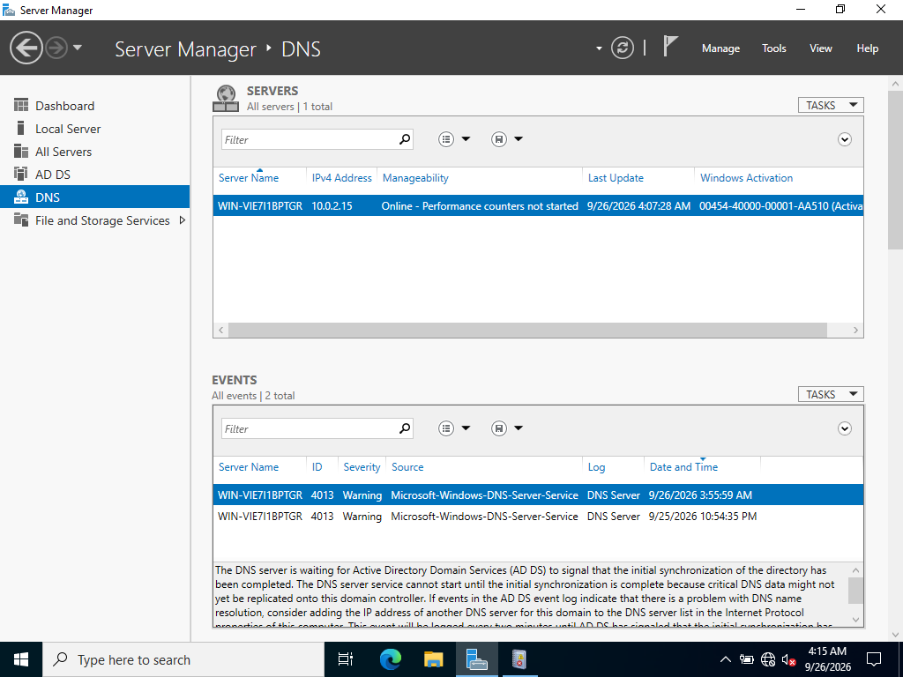
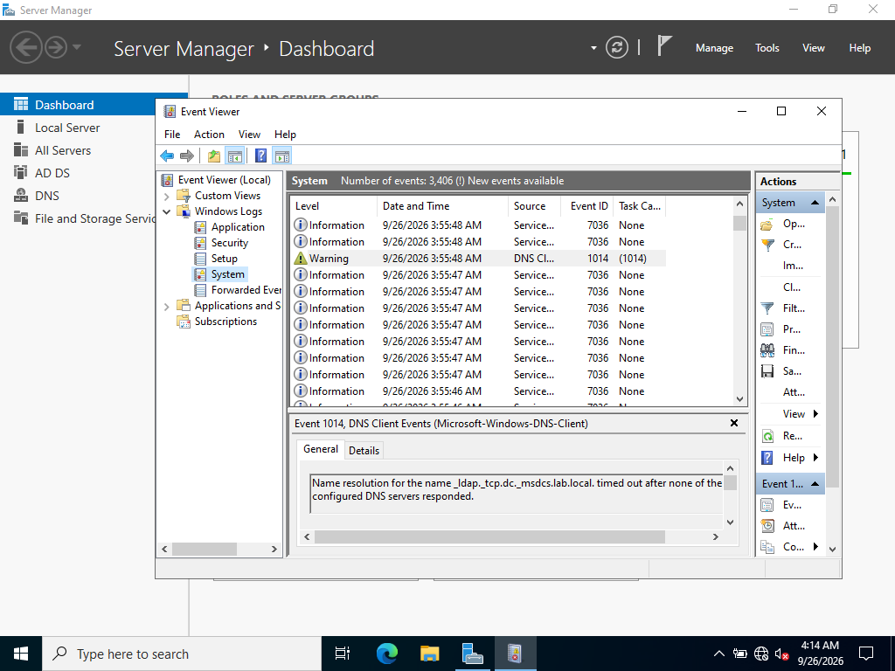
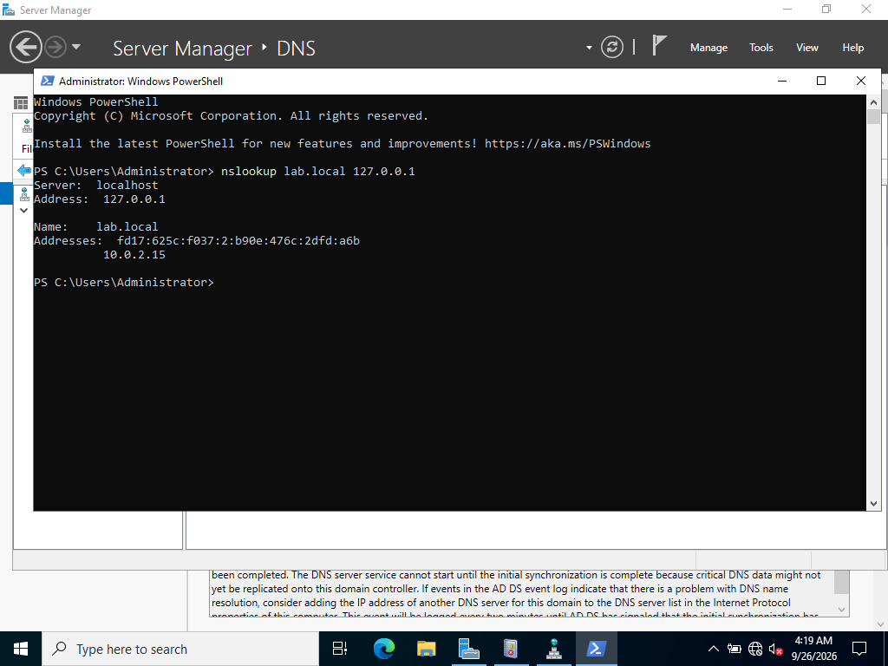
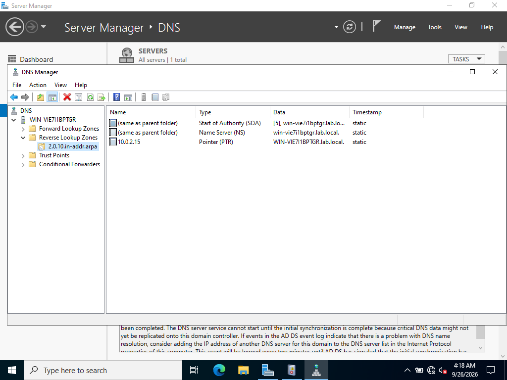

# DNS Troubleshooting: A Real Diagnostic Case

Rather than a clean configuration walkthrough, this section documents an
actual issue I diagnosed methodically: DNS timeouts and a reverse lookup
zone that never received a dynamically registered PTR record, including
everything I ruled out along the way. The process here is arguably more
instructive than a screenshot of something that worked on the first try.

## The symptom

After creating a reverse lookup zone and running `ipconfig /registerdns` on
the domain controller, no PTR record appeared. Checking the DNS role in
Server Manager surfaced a warning that was the actual starting point of the
investigation:

**Event ID 4013** (`Microsoft-Windows-DNS-Server-Service`): the DNS Server
service was waiting for AD DS to signal that initial directory
synchronization had completed, since it won't fully start until that
happens; critical DNS data might not yet be replicated onto the domain
controller otherwise.

Checking Event Viewer's System log directly showed the client-side
consequence of that same condition:

**Event ID 1014** (`Microsoft-Windows-DNS-Client`): name resolution for
`_ldap._tcp.dc._msdcs.lab.local`, the SRV record a client uses to locate a
domain controller for LDAP, timed out because none of the configured DNS
servers responded. With the DNS Server service still waiting on AD DS sync,
there was nothing available yet to answer that query.

## Diagnostic chain

Before concluding this was a startup-timing issue rather than a real
misconfiguration, I checked each of the following, ruling each one out in
turn rather than guessing at a fix:

1. **Dynamic Updates setting on the zone**: confirmed set to "Secure only,"
   not "None" (which would have been the obvious first culprit).
2. **The DC's own DNS server setting**: confirmed the network adapter
   pointed DNS at itself (`127.0.0.1` / `::1`), ruling out the classic
   "DC doesn't know where its own DNS service is" misconfiguration.
3. **"Register this connection's addresses in DNS"**: confirmed enabled
   on the adapter.
4. **Zone replication scope**: confirmed the reverse zone was genuinely
   AD-integrated ("Data is stored in Active Directory"), not a plain
   file-based zone silently ignoring the Dynamic Updates setting.
5. **DNS Server service health**: confirmed `Running` via
   `Get-Service -Name DNS`.
6. **Firewall rules**: confirmed all rules under the "DNS Service" display
   group were `Enabled`.
7. **DHCP Client service**: confirmed `Running` (this service, not just
   Netlogon, is responsible for dynamic A/PTR self-registration).
8. **Forced re-registration**: `ipconfig /flushdns`, restarting the
   Netlogon service, and re-running `ipconfig /registerdns` after each
   change; no PTR record appeared during this window.

## Confirming resolution

A direct query roughly 20 minutes after the initial warnings confirmed DNS
had become fully healthy:

`nslookup lab.local 127.0.0.1` returned a clean response, both an IPv6 and
the expected IPv4 address (`10.0.2.15`). This confirms the DNS service was, by
this point, genuinely healthy and answering queries correctly. This lines
up with the AD DS synchronization signal completing, matching Event 4013's
description of the expected behavior.

## What remains unresolved

Despite DNS becoming fully healthy, the reverse lookup zone's PTR record
never registered dynamically:

The `Timestamp` column reads **static** rather than a real date/time, the
marker for a manually entered record and not a dynamically registered one. I
added this record manually as a pragmatic workaround after exhausting the
diagnostic steps above, since it unblocked the rest of the AD/DNS work for
the week. It remains an open question I'd want to revisit with more time or
a second DC in the environment to test against (dynamic registration issues
in single-DC labs are a known category of quirk, distinct from the
sync-timing issue above, which I'm confident was correctly diagnosed).

## Takeaway

The value of this exercise was in the diagnostic process itself: correctly
identifying a documented AD/DNS startup dependency from the actual event
logs (rather than assuming a misconfiguration), systematically ruling out
zone settings, service health, and firewall rules one at a time, and being
honest about which part of the original question (the sync-timing warnings)
was fully explained, versus which narrower part (dynamic PTR
registration specifically) remains open.