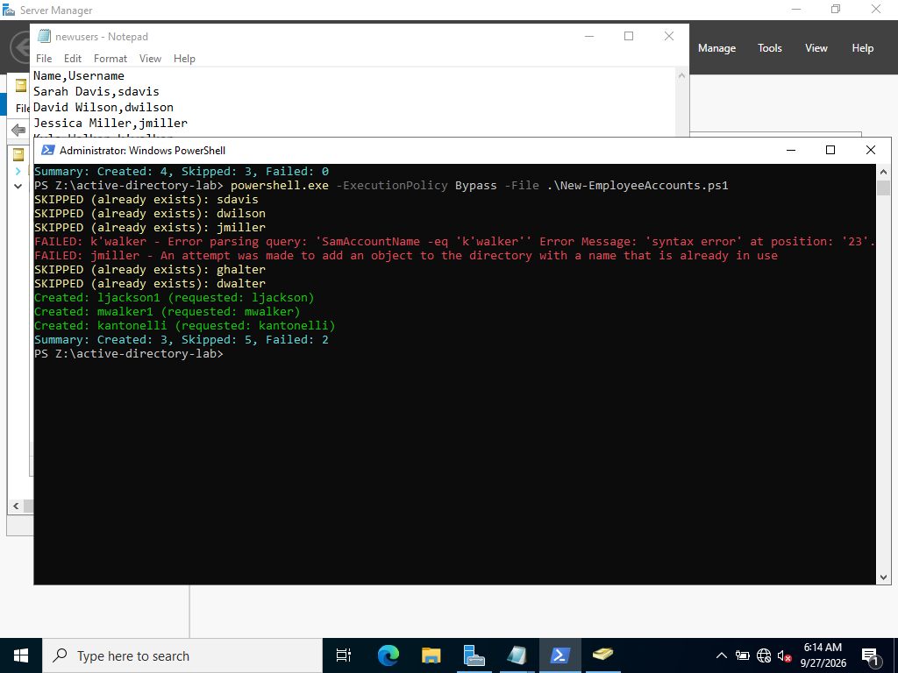
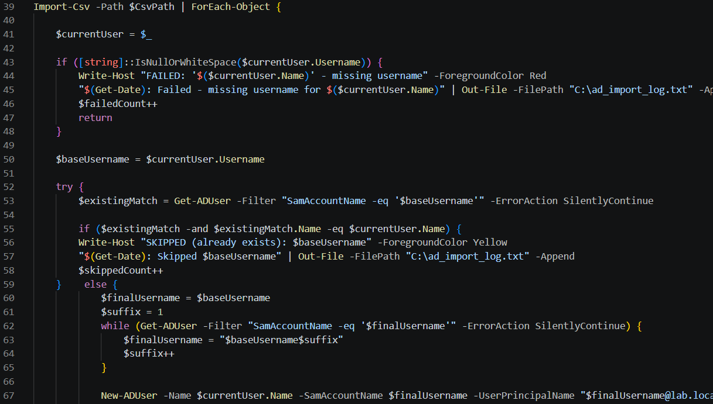
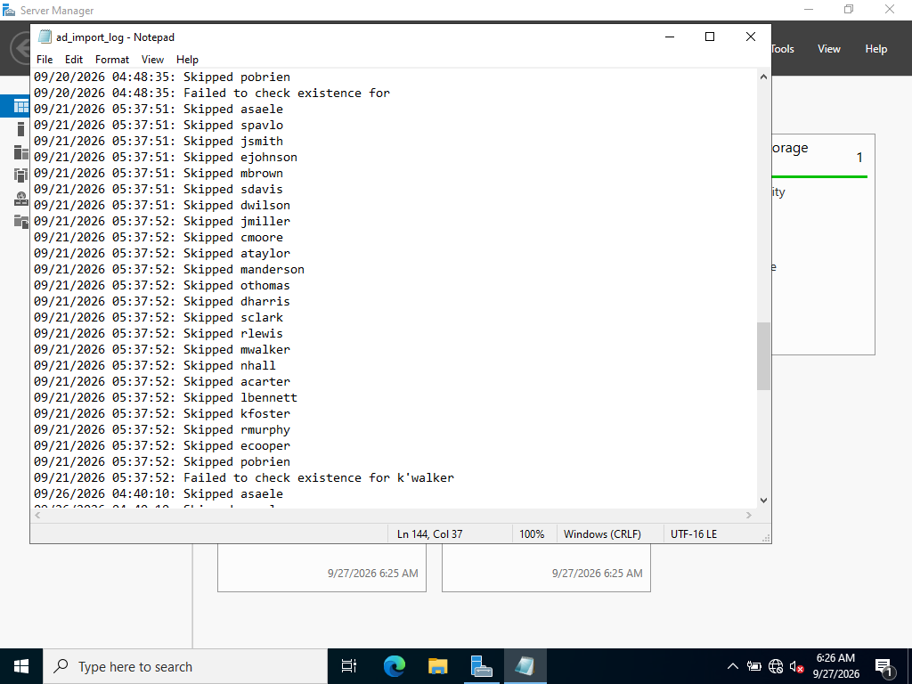
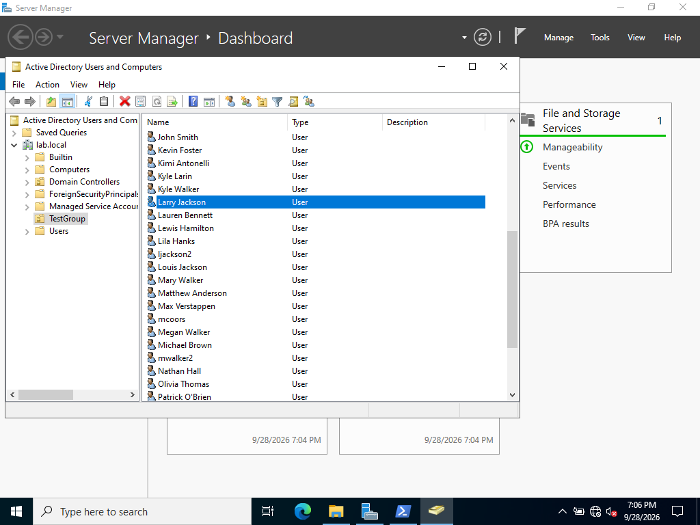
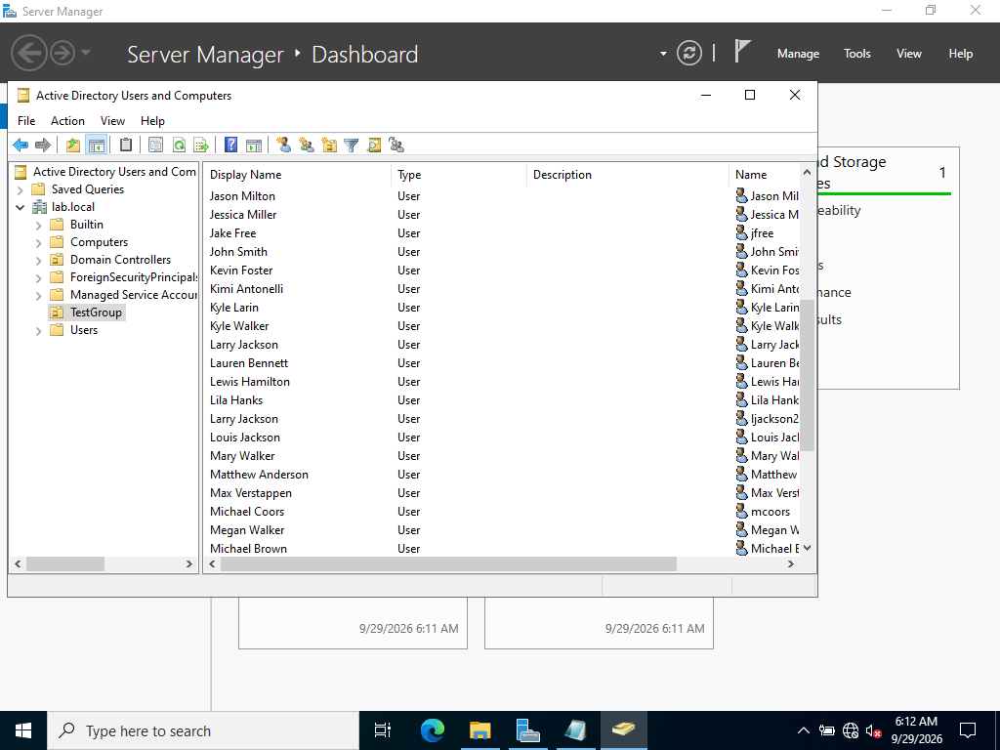
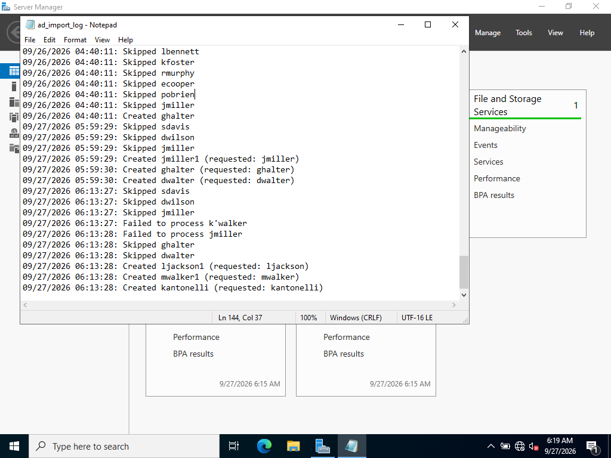

# PowerShell Automation: Bulk AD User Creation

## The script

`New-EmployeeAccounts.ps1` reads a CSV of new employees and creates an AD
account for each row automatically, a scripted replacement for the manual,
one-at-a-time account creation demonstrated in Section 2. It includes proper
comment-based help (`Get-Help .\New-EmployeeAccounts.ps1` works), a real
`param()` block for configurability, input validation, error handling, and
a summary report.



## Design decisions

- **Duplicate detection before creation**: each row is checked against
  existing accounts before attempting `New-ADUser`, so re-running the script
  against a partially-imported CSV doesn't fail or create duplicates.
- **Input validation before touching AD at all**: rows with a missing
  username are caught and logged before any AD call is made, the same
  boundary-validation principle I'd used validating fetch requests in
  earlier JavaScript projects.
- **Logging with a persistent summary**: every outcome is timestamped and
  appended to a log file, plus a final console summary with total counts.
- **Duplicate username detection and creation**: each row is checked against
  existing accounts before attempting `New-ADUser`, so re-running the script
  against a partially-imported CSV doesn't fail or create duplicates, however 
  if a duplicate username is detected, a search occurs to make sure that the
  name attached to the username is new, then it assigns a digit at the end of
  the username.

## Five real bugs, found by deliberately testing bad input

I tested the script against a CSV including a duplicate username, a row
with a missing username, and a username containing an apostrophe, rather
than only testing the clean, expected case.

**Bug 1: an empty filter value throws a hard error, not a clean "not found."** 
A missing-username row produced `SamAccountName -eq ''`, which
AD's filter provider rejects outright rather than treating as "no match."
Fixed with `[string]::IsNullOrWhiteSpace()` validation *before* the value
ever reaches AD.

**Bug 2: `$_` silently changes meaning inside a `catch` block.** The
original script referenced `$_.Username` inside `catch` to log which user
had failed but PowerShell automatically rebinds `$_` to the *error record* 
the instant execution enters `catch`, discarding what it meant in
the surrounding `ForEach-Object` scope. Failure log entries showed a blank
username as a result. Fixed by capturing the row into an explicitly named
variable before any `try`/`catch`:



The log file shows this fix in action directly. An early run shows
`Failed to check existence for` with no username attached (the bug), and a
later run shows `Failed to check existence for k'walker` with the username
correctly present (after the fix):



**Bug 3: a username containing an apostrophe breaks the AD filterstring.** 
Since the filter was built via direct string interpolation
(`"SamAccountName -eq '$($currentUser.Username)'"`), a username like
`k'walker` produced `SamAccountName -eq 'k'walker'` — an unbalanced,
malformed query, the same underlying category of bug as SQL injection:
untrusted input concatenated directly into a query string rather than
passed as data. This was caught live during testing:

> `FAILED: k'walker - Error parsing query: 'SamAccountName -eq 'k'walker''
> Error Message: 'syntax error' at position: '23'.`

Thanks to the Bug 2 fix already being in place, this failure was correctly
logged with the actual username attached, rather than silently corrupting
or crashing. The structural fix was to stop building the filter as a
string entirely, using PowerShell's script-block filter syntax instead,
passing the value as a variable reference rather than concatenated text,
which removes the injection surface altogether:

```powershell
Get-ADUser -Identity { SamAccountName -eq $samValue } -ErrorAction SilentlyContinue
```

Investigating this surfaced something more interesting than the bug itself:
despite the filter query failing to parse, the account was still created
successfully when the fix wasn't yet in place, because `New-ADUser
-SamAccountName` treats its input as a **literal attribute value**, never
parsed as an expression, and an apostrophe is a perfectly valid character
in a `sAMAccountName` as far as AD itself is concerned. Two different
mechanisms (one that parses text as a query, one that stores text as
data) reacting completely differently to the identical character. The
account was genuinely functional and could log in normally; the actual
risk was never that AD would reject the data, only that the tooling built
around it was fragile.

**Bug 4: the fix for Bug 3 introduced a new, subtler bug.** Switching to
PowerShell's script-block filter syntax (`-Filter { SamAccountName -eq
$var }`) resolved the apostrophe issue cleanly, but produced a worse
problem: genuine duplicate accounts (two imports of the same real person)
started silently passing the existence check and attempting creation
anyway, which Active Directory itself then rejected with *"an attempt was
made to add an object with a name that is already in use."* The root cause
was a scoping quirk, script-block filters don't always reliably resolve
variables that get reassigned inside a loop, causing the existence check to
silently report "not found" even when a match genuinely existed.

The error in the console was: *'Creating Name='Mary Walker' Sam='mwalker2' FAILED: 
mwalker - An attempt was made to add an object to the directory with a name that 
is already in use'*

The eventual fix was to stop using `-Filter` for this check entirely.
`-Identity` performs a direct lookup by literal value (SamAccountName,
DistinguishedName, GUID, or SID) with no query parser involved at all which
eliminates both the injection risk from Bug 3 and the scoping risk from
Bug 4 at once, since there was never a string being assembled or parsed in
the first place. This also surfaced a related discovery: `-Identity`'s
"not found" case is itself a terminating exception that
`-ErrorAction SilentlyContinue` does not suppress (identical in shape to
Bug 3's original filter-parsing error). This was resolved with an explicit, local
`try`/`catch` treating "not found" as the normal, expected outcome for any
genuinely new employee.

**Bug 5: SamAccountName and CN are independent uniqueness constraints.**
Even after Bug 4's fix correctly disambiguated usernames (`ljackson` →
`ljackson2`), account creation still failed for a genuine two-person name
collision. The reason: `-Name` (which becomes the object's CN) has its own
uniqueness requirement, separate from `-SamAccountName`, scoped to the OU
rather than the domain. Disambiguating the username alone left the CN
(`"Larry Jackson"`) still colliding with an existing object.

I considered appending a number to the display name (`"Larry Jackson
(2)"`), but rejected it. A modified-looking name in the directory is a
worse outcome than the problem it solves. 



The fix instead separates two attributes that don't need to 
match: `-Name` and `-SamAccountName` are both set to the already-disambiguated, 
guaranteed-unique username, while a separate `-DisplayName` parameter carries 
the real, unmodified human name.

Everyday tools (Outlook, the Global Address List, people search) read
`DisplayName`, not `Name` so every account displays correctly to a
normal user regardless of which underlying identifier had to be
disambiguated. The one tradeoff: ADUC's default list view shows `Name`
rather than `DisplayName`, so a colliding account shows its technical
identifier there unless the Display Name column is explicitly added via
View → Add/Remove Columns. This was a deliberate, documented tradeoff rather than
an oversight.



Accounts created before this fix predate the `DisplayName` attribute
entirely, so I wrote a short, separate one-time script to backfill it for
existing accounts, rather than leaving inconsistent historical data:

```powershell
Get-ADUser -Filter * -SearchBase $ouPath -Properties DisplayName | Where-Object { -not $_.DisplayName } | ForEach-Object {
    Set-ADUser -Identity $_.SamAccountName -DisplayName $_.Name
}
```

## Result

Across several test runs with deliberately malformed input, the script
correctly created, skipped, and failed rows as expected. 

The final script correctly handles duplicate re-imports (skipped),
genuine name collisions between different people (disambiguated
automatically on both username and CN, with a clean, correct display
name preserved), missing data (caught before reaching AD), and unusual
but valid characters in real names.

Every outcome accurately reflected in both the console output and the persistent
log, including the specific username involved in every failure.

## Conclusion and Takeaway

I used this project to understand what I could do with user creation regarding Active Directory 
within the confines of a Powershell script. I realise that in an actual work environment
I wouldn't use the just names of employees to do this, but rather something like appending their 
employee ID /numbers. However, I proceeded with this just so I could see the limitations and work through
actual bugs and find solutions to the issues that this method would lead to. As a result, I
was able to conceptually understand why large companys (or even medium-sized enterprises)
would rather use employee ID numbers in conjuction with the names.

